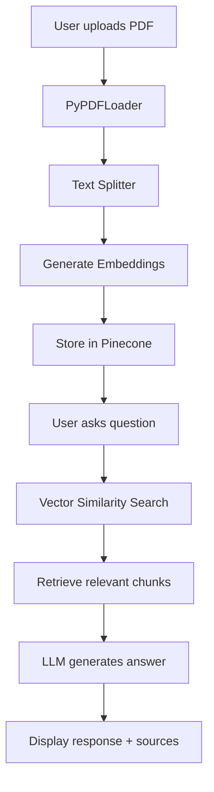

# 📄 Chat with PDF - RAG Application

A Retrieval-Augmented Generation (RAG) application built with Streamlit that allows users to upload PDF documents and ask questions about their content using natural language. The application provides transparent AI responses by showing users the source documents and relevant sections used to generate each answer.

App is deployed and hosted at : https://ask-pdf-ai.streamlit.app/

## 🚀 Features

- **PDF Upload**: Upload and process PDF documents in real-time
- **Intelligent Chunking**: Automatically splits documents into optimized chunks
- **Vector Search**: Uses embedding-based similarity search for relevant content retrieval
- **AI-Powered Responses**: Generates contextual answers using Groq's LLaMA model
- **Document Isolation**: Each uploaded document is processed independently
- **Interactive UI**: Clean, user-friendly Streamlit interface
- **Source Citations**: Shows relevant document sections used for answers

## 🏗️ Architecture



## 🛠️ Tech Stack

- **Frontend**: Streamlit
- **Document Processing**: LangChain, PyPDF
- **Embeddings**: Cohere Embeddings (embed-english-light-v3.0)
- **Vector Database**: Pinecone
- **LLM**: Groq (LLaMA 3.1 8B)
- **Text Processing**: LangChain Text Splitters

## 📋 Prerequisites

- Python 3.8+
- Groq API Key
- Pinecone API Key
- Pinecone Index

## 🔧 Installation

1. **Clone the repository**
```bash
git clone <repository-url>
cd chat-with-pdf
```

2. **Create virtual environment**
```bash
python -m venv DocQAenv
source DocQAenv/bin/activate  # On Windows: DocQAenv\Scripts\activate
```

3. **Install dependencies**
```bash
pip install streamlit
pip install langchain
pip install langchain-community
pip install langchain-text-splitters
pip install langchain-cohere
pip install langchain-groq
pip install langchain-pinecone
pip install pinecone-client
pip install pypdf
pip install cohere
```

4. **Set up environment variables**

Create a `.env` file in the project root:
```env
# Get from https://console.groq.com/
DocQAKey=your_groq_api_key_here

# Get from https://app.pinecone.io/
docqa_pinecone=your_pinecone_api_key_here

# Get from https://dashboard.cohere.ai/api-keys
cohere_embedding=your_cohere_embeddings_api_key_here
```

Or set them as system environment variables:
```bash
# Get from https://console.groq.com/
export DocQAKey="your_groq_api_key_here"

# Get from https://app.pinecone.io/
export docqa_pinecone="your_pinecone_api_key_here"

# Get from https://dashboard.cohere.ai/api-keys
export cohere_embedding="your_cohere_embeddings_api_key_here"
```

## 🚀 Usage

1. **Run the application**
```bash
streamlit run app.py
```

2. **Access the app**
   - Open your browser and go to `http://localhost:8501`

3. **Upload and Query**
   - Click "Choose a PDF file" to upload your document
   - Wait for processing to complete
   - Type your question in the text input
   - Get AI-generated answers with source citations

## 📁 Project Structure

```
chat-with-pdf/
│
├── app.py                 # Main Streamlit application
├── README.md             # This file
├── requirements.txt      # Python dependencies
├── .env                  # Environment variables (create this)
└── .gitignore           # Git ignore file
```

## 📊 How It Works

1. **Document Processing**:
   - PDF is uploaded and temporarily saved
   - PyPDFLoader extracts text from all pages
   - Text is split into smaller chunks with overlap
   - Each chunk gets a unique document ID

2. **Vectorization**:
   - Cohere embeddings convert text chunks to vectors
   - Vectors are stored in Pinecone with metadata

3. **Query Processing**:
   - User question is converted to vector
   - Similarity search finds relevant chunks
   - Chunks are filtered by document ID

4. **Answer Generation**:
   - Relevant chunks provide context
   - LLM generates answer based on context
   - Sources are shown for transparency

---

**Built with ❤️ using Streamlit and LangChain**
